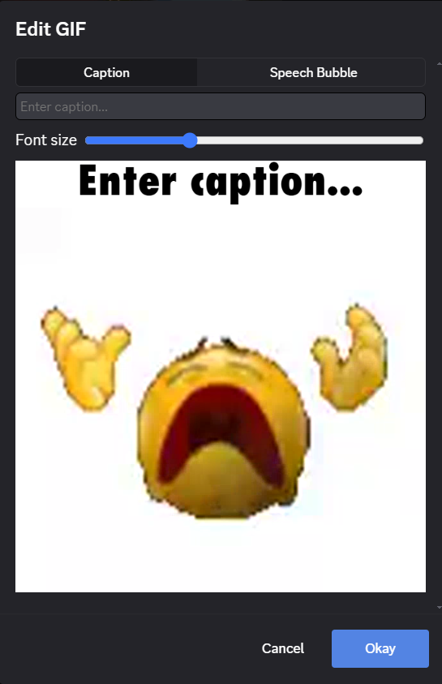
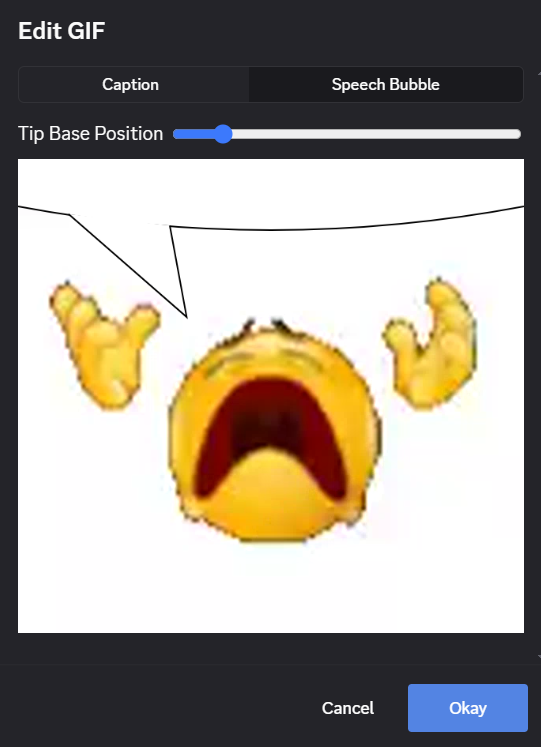

# GifCaptioner

This plugin adds a way to add a custom caption to gifs in your gif picker directly within discord. Gifs inside the gif picker will have a new button at the top left that will open a dialog to create a custom caption.

After completing this the gif will be rendered with the caption and sent to the channel you are currently in. You also have the option to add a speechbubble to the gif instead. Clicking on the gif will move where the tip of the speechbubble is.

## Installation

To install, download the plugin [here](/build/GifCaptioner.plugin.js) and put it in your BetterDiscord plugins folder.

## Quality

The quality of captioned gifs will sometimes be a bit lower than the original. This is because tenor does not actually use gifs, but rather looped MP4s. Converting to a gif will often result in a loss of quality.