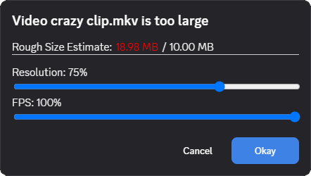

# VideoCompressor

This plugin will open up a menu that allows you to easily compress videos that would otherwise be too large to upload before you send them.

## Usage

When you attempt to upload a video that is larger than your max upload size a popup will appear that lets you change the video's framerate and resolution. A size estimate will be shown, but it can be wildly inconsistent depending on things like the input file format. It will generally over-estimate. The plugin will then render the video with the new attributes and attach it.